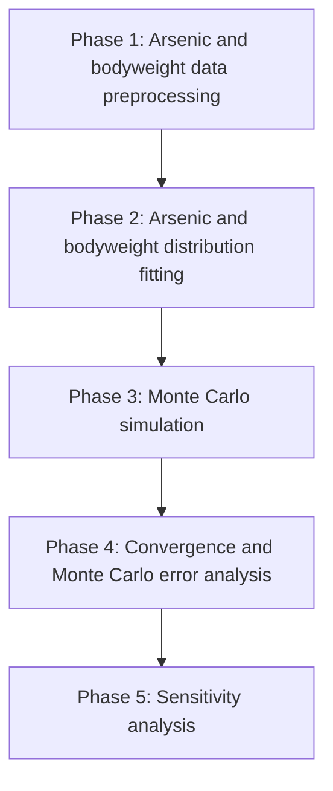
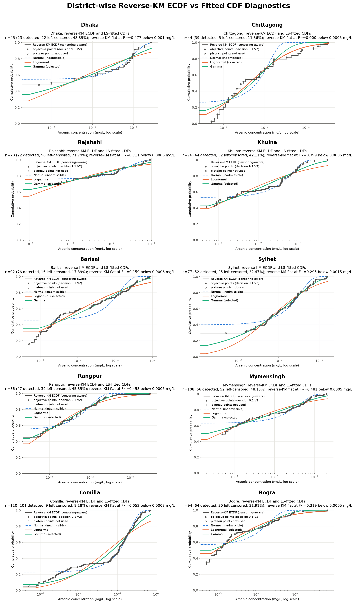
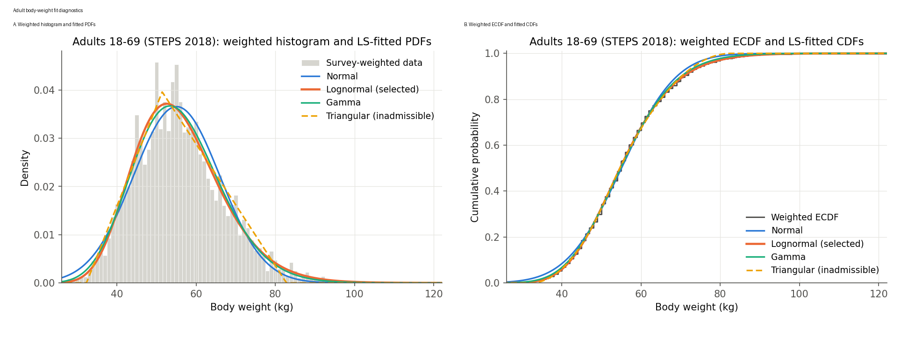
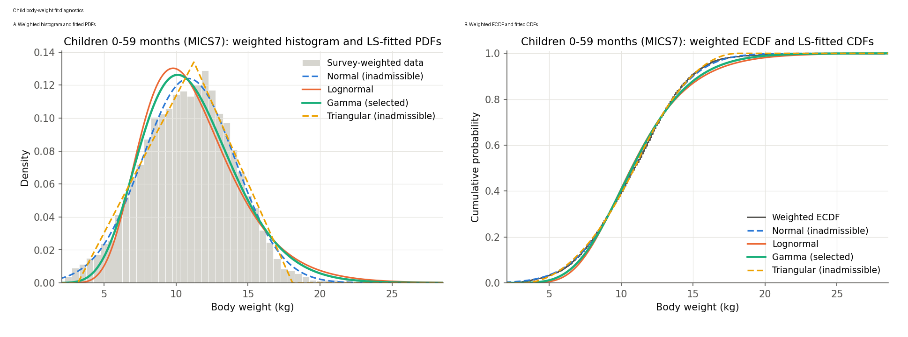

# Bangladesh Arsenic Health-Risk Model

## Base Paper

**Yadav, S. & Kalkal, S. (2024). _Health risk assessment using Monte-Carlo simulations due to arsenic contamination in groundwater in Punjab._ Journal of Water and Health, 22(12), 2304-2319. DOI: 10.2166/wh.2024.188.**

## What The Base Paper Did

- Assessed arsenic-related health risk from contaminated groundwater in Punjab.
- Calculated both non-carcinogenic risk and carcinogenic risk for adults and children.
- Used ingestion and dermal exposure pathways.
- Applied Monte Carlo simulation to represent uncertainty in exposure inputs.
- Reported district-wise 95th percentile HI and ELCR values, threshold exceedance, and sensitivity results.

## What We Did Differently

- Adapted the Punjab model framework to Bangladesh.
- Replaced Punjab arsenic inputs with district-wise Bangladesh groundwater arsenic data.
- Fitted arsenic concentration distributions separately for selected Bangladesh districts.
- Replaced generic body-weight assumptions with Bangladesh survey-based adult and child body-weight models.
- Used explicit inverse-CDF Monte Carlo sampling for reproducibility.
- Added convergence and Monte Carlo error analysis to check numerical stability.
- Documented assumptions, parameter choices, and data-source limitations more explicitly.

## Risk Equations

### Ingestion Average Daily Dose

$$
ADD_{\text{ing}}
=
\frac{
C\times IR\times EF\times ED
}{
BW\times AT_{nc}
}
$$

where $ADD_{\text{ing}}$ is in $\text{mg kg}^{-1}\text{day}^{-1}$.

### Dermal Average Daily Dose

$$
ADD_{\text{dermal}}
=
\frac{
C\times K_p\times EF\times ED\times ET\times SA\times CF
}{
BW\times AT_{nc}
}
$$

where $ADD_{\text{dermal}}$ is in $\text{mg kg}^{-1}\text{day}^{-1}$.

### Non-Carcinogenic Risk

$$
HQ_{\text{ing}}
=
\frac{ADD_{\text{ing}}}{RfD_{\text{ing}}}
$$

$$
HQ_{\text{dermal}}
=
\frac{ADD_{\text{dermal}}}{RfD_{\text{dermal}}}
$$

$$
HI=HQ_{\text{ing}}+HQ_{\text{dermal}}
$$

$HQ$ and $HI$ are dimensionless. The main non-carcinogenic concern threshold is $HI>1$.

### Carcinogenic Risk

$$
ELCR=ADD_{\text{ing,cancer}}\times CSF
$$

$ADD_{\text{ing,cancer}}$ is the ingestion ADD equation evaluated with $AT_{cancer}$ instead of $AT_{nc}$. $ELCR$ is dimensionless and interpreted as an excess lifetime cancer-risk probability.

### Averaging Time

$$
AT_{nc}=ED\times365
$$

$$
AT_{cancer}=70\times365=25{,}550\ \text{days}
$$

## Parameters Table

| Parameter | Meaning | Selected value/source | Unit |
|---|---|---|---|
| $C$ | Arsenic concentration | District-specific final models: Gamma for Dhaka, Rajshahi, Khulna, Barisal, Sylhet, Rangpur, Mymensingh, and Comilla; Lognormal for Chittagong and Bogra | mg/L |
| $IR$ | Drinking-water ingestion rate | Lognormal; reported arithmetic mean/SD $1.26\pm0.66$, converted to $(\mu_{\log},\sigma_{\log})=(0.109883,0.492399)$ | L/day |
| $EF$ | Exposure frequency | Deterministic: 365; Probabilistic: Triangular with minimum 180, mode 345, maximum 365 | days/year |
| $ED$ | Exposure Duration | 70 years for adults, 6 years for children | years |
| $BW$ | Body weight | Adult: Lognormal $(\mu_{\log}=4.002396,\sigma_{\log}=0.200174)$; Child: Normal $(\mu=10.857019,\sigma=3.228093)$ truncated below at 1.6 kg | kg |
| $AT$ | Averaging time | Non-cancer: $AT_{nc}=ED\times365$; primary cancer: $AT_{cancer}=25{,}550$ for adults and children | days |
| $ET$ | Dermal exposure time | Deterministic: 0.58; Probabilistic: Triangular with minimum 0.13, mode 0.20, maximum 0.33 | h/day |
| $SA$ | Exposed skin surface area | Adult: Lognormal $(\mu_{\log}=0.327378,\sigma_{\log}=0.215774)$ after arithmetic-moment conversion; Child: Triangular $(0.29,0.60,0.95)$ | $\text{m}^2$ |
| $K_p$ | Dermal permeability coefficient | 0.001 | cm/h |
| $CF$ | Unit conversion factor | 10, as used in base paper | $\text{L}/(\text{cm}\cdot\text{m}^2)$ |
| $RfD_{\text{ing}}$ | Oral reference dose | 0.0003 | $\text{mg kg}^{-1}\text{day}^{-1}$ |
| $RfD_{\text{dermal}}$ | Dermal reference dose | 0.000285 | $\text{mg kg}^{-1}\text{day}^{-1}$ |
| $CSF$ | Cancer slope factor | 1.5 | $(\text{mg kg}^{-1}\text{day}^{-1})^{-1}$ |

Notes from the design document:

- The conversion factor is resolved dimensionally: $1\ \text{cm}\times1\ \text{m}^2=0.01\ \text{m}^3=10\ \text{L}$, so $CF=10\ \text{L}/(\text{cm}\cdot\text{m}^2)$.
- The CSF unit is written as inverse dose so that $ELCR$ is dimensionless; the base paper prints the CSF unit as a dose unit, which is dimensionally inconsistent with its ELCR equation.

## Data Sources

- **Bangladesh groundwater arsenic:** DPHE/BGS/DFID National Hydrochemical Survey of Bangladesh groundwater; 
- **Adult body weight:** WHO NCD Microdata Repository, Bangladesh STEPS 2018; 
- **Child body weight:** UNICEF Bangladesh MICS child anthropometry data; 

## Project Flowchart

# Arsenic Distribution Fit 

## District List

The arsenic fitting workflow was run for the following 10 selected districts:

- Dhaka
- Chittagong
- Rajshahi
- Khulna
- Barisal
- Sylhet
- Rangpur
- Mymensingh
- Comilla
- Bogra

## Method

For each district, the arsenic concentration distribution was estimated using the detected and left-censored observations from the preprocessed arsenic dataset.

Reverse Kaplan-Meier was applied separately within each district to estimate a censoring-aware empirical CDF. Least-squares CDF fitting was then used to fit three candidate distributions to that district-specific empirical CDF:

- Normal
- Lognormal
- Gamma

The main fitting metric was the CDF RMSE from the least-squares fit. Bootstrap support reports how often the distribution won the admissible LS-RMSE contest. The final simulation distribution is marked with a single tick.

The Phase 7 review accepted nine provisional selections and overrode one: Barisal changed from Lognormal to Gamma after tail checks showed that the Lognormal fitted P99 was 26 times the empirical P99, its fitted mean was 29 times the reverse-KM mean, and 7.5% of draws exceeded the largest measured concentration. Candidate-fit statistics below are retained unchanged; the selection marker reflects the final model actually used in simulation.

## Fit Results

| District | Distribution | Parameters | CDF RMSE | Bootstrap support | Final simulation selection |
|---|---|---|---:|---|:---:|
| Dhaka | Normal | $\mu=-0.0123$; $\sigma=0.1087$ | 0.0228 | LS win 0.0% (n=1000) |  |
| Dhaka | Lognormal | $\mu_{\log}=-5.9154$; $\sigma_{\log}=3.9033$ | 0.0621 | LS win 0.5% (n=1000) |  |
| Dhaka | Gamma | $k=0.1489$; $\theta=0.4425$ | 0.0463 | LS win 99.5% (n=1000) | &#10003; |
| Chittagong | Normal | $\mu=0.0064$; $\sigma=0.0095$ | 0.1073 | LS win 0.0% (n=994) |  |
| Chittagong | Lognormal | $\mu_{\log}=-5.4876$; $\sigma_{\log}=1.9829$ | 0.0462 | LS win 98.8% (n=994) | &#10003; |
| Chittagong | Gamma | $k=0.4564$; $\theta=0.0253$ | 0.0697 | LS win 1.2% (n=994) |  |
| Rajshahi | Normal | $\mu=-0.0296$; $\sigma=0.0420$ | 0.0193 | LS win 0.0% (n=1000) |  |
| Rajshahi | Lognormal | $\mu_{\log}=-9.7730$; $\sigma_{\log}=4.6229$ | 0.0264 | LS win 2.0% (n=1000) |  |
| Rajshahi | Gamma | $k=0.0682$; $\theta=0.1520$ | 0.0164 | LS win 98.0% (n=1000) | &#10003; |
| Khulna | Normal | $\mu=-0.0058$; $\sigma=0.0766$ | 0.0361 | LS win 0.0% (n=1000) |  |
| Khulna | Lognormal | $\mu_{\log}=-6.3854$; $\sigma_{\log}=3.9430$ | 0.0521 | LS win 6.5% (n=1000) |  |
| Khulna | Gamma | $k=0.1447$; $\theta=0.3278$ | 0.0357 | LS win 93.5% (n=1000) | &#10003; |
| Barisal | Normal | $\mu=0.0158$; $\sigma=0.1348$ | 0.0960 | LS win 0.0% (n=1000) |  |
| Barisal | Lognormal | $\mu_{\log}=-5.2479$; $\sigma_{\log}=3.5345$ | 0.0415 | LS win 84.4% (n=1000) |  |
| Barisal | Gamma | $k=0.1724$; $\theta=0.5818$ | 0.0447 | LS win 15.6% (n=1000) | &#10003; |
| Sylhet | Normal | $\mu=0.0084$; $\sigma=0.0320$ | 0.0419 | LS win 0.0% (n=1000) |  |
| Sylhet | Lognormal | $\mu_{\log}=-5.0215$; $\sigma_{\log}=2.0617$ | 0.0355 | LS win 5.8% (n=1000) |  |
| Sylhet | Gamma | $k=0.3498$; $\theta=0.0664$ | 0.0168 | LS win 94.2% (n=1000) | &#10003; |
| Rangpur | Normal | $\mu=-0.0013$; $\sigma=0.0114$ | 0.0344 | LS win 0.0% (n=1000) |  |
| Rangpur | Lognormal | $\mu_{\log}=-7.2105$; $\sigma_{\log}=2.6081$ | 0.0258 | LS win 15.7% (n=1000) |  |
| Rangpur | Gamma | $k=0.2056$; $\theta=0.0267$ | 0.0114 | LS win 84.3% (n=1000) | &#10003; |
| Mymensingh | Normal | $\mu=-0.0179$; $\sigma=0.0539$ | 0.0418 | LS win 0.0% (n=1000) |  |
| Mymensingh | Lognormal | $\mu_{\log}=-7.7219$; $\sigma_{\log}=3.9658$ | 0.0307 | LS win 44.2% (n=1000) |  |
| Mymensingh | Gamma | $k=0.1100$; $\theta=0.1913$ | 0.0230 | LS win 55.8% (n=1000) | &#10003; |
| Comilla | Normal | $\mu=0.1124$; $\sigma=0.1496$ | 0.0431 | LS win 0.0% (n=1000) |  |
| Comilla | Lognormal | $\mu_{\log}=-2.8795$; $\sigma_{\log}=2.3354$ | 0.0973 | LS win 0.0% (n=1000) |  |
| Comilla | Gamma | $k=0.4364$; $\theta=0.4201$ | 0.0664 | LS win 100.0% (n=1000) | &#10003; |
| Bogra | Normal | $\mu=-0.0036$; $\sigma=0.0238$ | 0.0754 | LS win 0.0% (n=1000) |  |
| Bogra | Lognormal | $\mu_{\log}=-7.0228$; $\sigma_{\log}=2.8619$ | 0.0322 | LS win 99.5% (n=1000) | &#10003; |
| Bogra | Gamma | $k=0.1677$; $\theta=0.0646$ | 0.0438 | LS win 0.5% (n=1000) |  |

## ECDF-CDF Diagnostic Plots

## Final Arsenic Models Used in Simulation

| Final family | Districts |
|---|---|
| Gamma | Dhaka, Rajshahi, Khulna, Barisal, Sylhet, Rangpur, Mymensingh, Comilla |
| Lognormal | Chittagong, Bogra |

Rajshahi is retained with a high-censoring warning (71.8%). Bogra's heavy Lognormal upper tail and Rangpur's thin Gamma extreme tail remain explicit model-uncertainty items. Full selection evidence and the Barisal override are documented in D6-D10 of the simulation report.

# Body-Weight Fit 

## Weighted ECDF and Fit Method

For each population, observations were sorted by measured body weight and tied body-weight values were aggregated. Survey weights were normalized as `q = w / sum(w)`. The empirical CDF used midpoint plotting positions:

$$
p_j
=
\sum_{r<j} q_r
+
\frac{1}{2}q_j
$$

where `q_j` is the normalized survey mass at the distinct body-weight value `x_j`.

Each Phase 5 candidate distribution was fitted by survey-weighted CDF least squares:

$$
\operatorname*{arg\,min}_{\theta}
\sum_j q_j\left[F(x_j;\theta)-p_j\right]^2
$$

This was the primary fitting criterion. Survey-weighted pseudo-MLE fits were also computed as robustness checks. In the Phase 7 final review, a child Normal truncated below at the lightest observed weight (1.6 kg) was fitted and assessed as a physically admissible alternative to the provisional Gamma model.

## Fit Results

| Population | Distribution | LS parameters | SSE_w | D_w | Tail error | Final simulation selection |
|---|---|---|---:|---:|---:|:---:|
| Adult | Normal | &mu;=55.08, &sigma;=10.91 | 2.28e-4 | 0.030 | 12.7% |  |
| Adult | Lognormal | &mu;log=4.0024, &sigma;log=0.2002 | 1.96e-5 | 0.019 | 1.0% | &#10003; |
| Adult | Gamma | k=25.27, &theta;=2.199 | 4.33e-5 | 0.020 | 3.6% |  |
| Adult | Triangular | a=32.3, m=51.4, b=82.8 | 6.94e-5 | 0.027 | 10.0% |  |
| Child | Normal | &mu;=10.87, &sigma;=3.22 | 2.85e-5 | 0.009 | 5.2% |  |
| Child | Lognormal | &mu;log=2.3706, &sigma;log=0.2993 | 5.96e-4 | 0.043 | 49.7% |  |
| Child | Gamma | k=11.392, &theta;=0.9725 | 3.15e-4 | 0.032 | 37.2% |  |
| Child | Triangular | a=3.17, m=11.23, b=18.09 | 3.08e-5 | 0.015 | 19.6% |  |
| Child | Truncated Normal | parent &mu;=10.8570, parent &sigma;=3.2281, L=1.6 kg | 2.94e-5 | 0.0096 | 1.7% | &#10003; |

Tail error is the largest relative quantile error over P1, P5, P95, and P99. `D_w` is the maximum weighted CDF discrepancy.

## Diagnostic Figures

### Adult

### Child

## Final Body-Weight Models Used in Simulation

| Population | Final model | Parameters |
|---|---|---|
| Adult | Lognormal | &mu;log=4.002396, &sigma;log=0.200174 |
| Child | Truncated Normal | parent &mu;=10.857019, parent &sigma;=3.228093, L=1.6 kg |

The child lower bound is the lightest cleaned MICS child weight, so the final model does not extrapolate below the observed data. The truncated Normal replaces the provisional Gamma selection: its weighted CDF SSE is about 11 times smaller, its worst P1-P99 quantile error is 1.7% rather than 36%, and its $E[1/BW]$ is within 0.1% of the weighted empirical value. These dose-relevant checks drove D8 in the simulation report.
