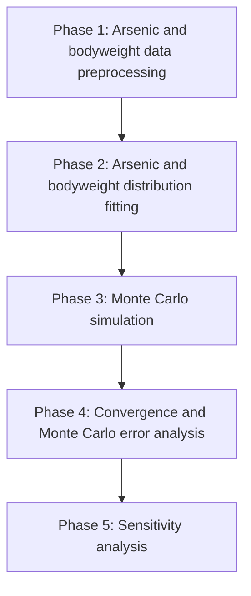

# Inception Report: Bangladesh Arsenic Health-Risk Model

## Base Paper

**Yadav, S. & Kalkal, S. (2024). _Health risk assessment using Monte-Carlo simulations due to arsenic contamination in groundwater in Punjab._ Journal of Water and Health, 22(12), 2304-2319. DOI: 10.2166/wh.2024.188.**

## What The Base Paper Did

- Assessed arsenic-related health risk from contaminated groundwater in Punjab.
- Calculated both non-carcinogenic risk and carcinogenic risk for adults and children.
- Used ingestion and dermal exposure pathways.
- Applied Monte Carlo simulation to represent uncertainty in exposure inputs.
- Reported district-wise 95th percentile HI and ELCR values, threshold exceedance, and sensitivity results.

## What We Did Differently

- Adapted the Punjab model framework to Bangladesh.
- Replaced Punjab arsenic inputs with district-wise Bangladesh groundwater arsenic data.
- Fitted arsenic concentration distributions separately for selected Bangladesh districts.
- Replaced generic body-weight assumptions with Bangladesh survey-based adult and child body-weight models.
- Used explicit inverse-CDF Monte Carlo sampling for reproducibility.
- Added convergence and Monte Carlo error analysis to check numerical stability.
- Documented assumptions, parameter choices, and data-source limitations more explicitly.

## Risk Equations

### Ingestion Average Daily Dose

$$
ADD_{\text{ing}}
=
\frac{
C\times IR\times EF\times ED
}{
BW\times AT_{nc}
}
$$

where $ADD_{\text{ing}}$ is in $\text{mg kg}^{-1}\text{day}^{-1}$.

### Dermal Average Daily Dose

$$
ADD_{\text{dermal}}
=
\frac{
C\times K_p\times EF\times ED\times ET\times SA\times CF
}{
BW\times AT_{nc}
}
$$

where $ADD_{\text{dermal}}$ is in $\text{mg kg}^{-1}\text{day}^{-1}$.

### Non-Carcinogenic Risk

$$
HQ_{\text{ing}}
=
\frac{ADD_{\text{ing}}}{RfD_{\text{ing}}}
$$

$$
HQ_{\text{dermal}}
=
\frac{ADD_{\text{dermal}}}{RfD_{\text{dermal}}}
$$

$$
HI=HQ_{\text{ing}}+HQ_{\text{dermal}}
$$

$HQ$ and $HI$ are dimensionless. The main non-carcinogenic concern threshold is $HI>1$.

### Carcinogenic Risk

$$
ELCR=ADD_{\text{ing,cancer}}\times CSF
$$

$ADD_{\text{ing,cancer}}$ is the ingestion ADD equation evaluated with $AT_{cancer}$ instead of $AT_{nc}$. $ELCR$ is dimensionless and interpreted as an excess lifetime cancer-risk probability.

### Averaging Time

$$
AT_{nc}=ED\times365
$$

$$
AT_{cancer}=70\times365=25{,}550\ \text{days}
$$

## Parameters Table

| Parameter | Meaning | Selected value/source | Unit |
|---|---|---|---|
| $C$ | Arsenic concentration | District-specific final models: Gamma for Dhaka, Rajshahi, Khulna, Barisal, Sylhet, Rangpur, Mymensingh, and Comilla; Lognormal for Chittagong and Bogra | mg/L |
| $IR$ | Drinking-water ingestion rate | Lognormal; reported arithmetic mean/SD $1.26\pm0.66$, converted to $(\mu_{\log},\sigma_{\log})=(0.109883,0.492399)$ | L/day |
| $EF$ | Exposure frequency | Deterministic: 365; Probabilistic: Triangular with minimum 180, mode 345, maximum 365 | days/year |
| $ED$ | Exposure Duration | 70 years for adults, 6 years for children | years |
| $BW$ | Body weight | Adult: Lognormal $(\mu_{\log}=4.002396,\sigma_{\log}=0.200174)$; Child: Normal $(\mu=10.857019,\sigma=3.228093)$ truncated below at 1.6 kg | kg |
| $AT$ | Averaging time | Non-cancer: $AT_{nc}=ED\times365$; primary cancer: $AT_{cancer}=25{,}550$ for adults and children | days |
| $ET$ | Dermal exposure time | Deterministic: 0.58; Probabilistic: Triangular with minimum 0.13, mode 0.20, maximum 0.33 | h/day |
| $SA$ | Exposed skin surface area | Adult: Lognormal $(\mu_{\log}=0.327378,\sigma_{\log}=0.215774)$ after arithmetic-moment conversion; Child: Triangular $(0.29,0.60,0.95)$ | $\text{m}^2$ |
| $K_p$ | Dermal permeability coefficient | 0.001 | cm/h |
| $CF$ | Unit conversion factor | 10, as used in base paper | $\text{L}/(\text{cm}\cdot\text{m}^2)$ |
| $RfD_{\text{ing}}$ | Oral reference dose | 0.0003 | $\text{mg kg}^{-1}\text{day}^{-1}$ |
| $RfD_{\text{dermal}}$ | Dermal reference dose | 0.000285 | $\text{mg kg}^{-1}\text{day}^{-1}$ |
| $CSF$ | Cancer slope factor | 1.5 | $(\text{mg kg}^{-1}\text{day}^{-1})^{-1}$ |

Notes from the design document:

- The conversion factor is resolved dimensionally: $1\ \text{cm}\times1\ \text{m}^2=0.01\ \text{m}^3=10\ \text{L}$, so $CF=10\ \text{L}/(\text{cm}\cdot\text{m}^2)$.
- The CSF unit is written as inverse dose so that $ELCR$ is dimensionless; the base paper prints the CSF unit as a dose unit, which is dimensionally inconsistent with its ELCR equation.

## Data Sources

- **Bangladesh groundwater arsenic:** DPHE/BGS/DFID National Hydrochemical Survey of Bangladesh groundwater; 
- **Adult body weight:** WHO NCD Microdata Repository, Bangladesh STEPS 2018; 
- **Child body weight:** UNICEF Bangladesh MICS child anthropometry data; 

## Project Flowchart

