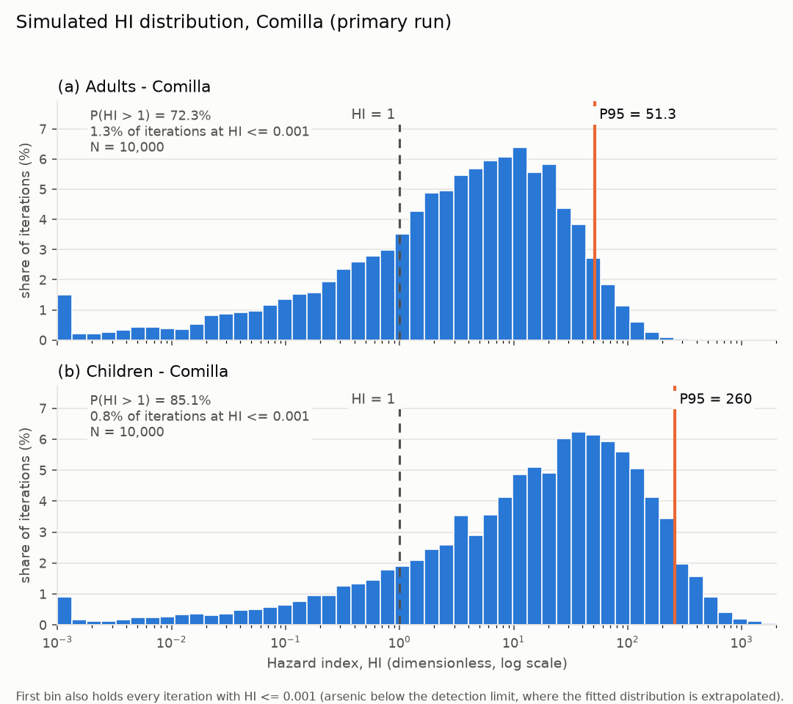
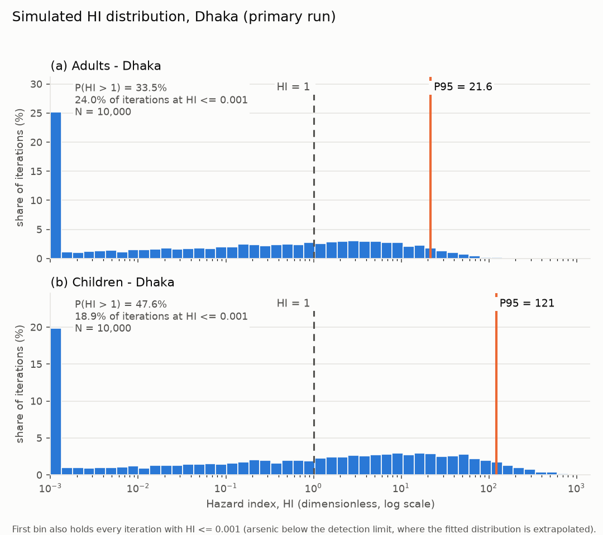
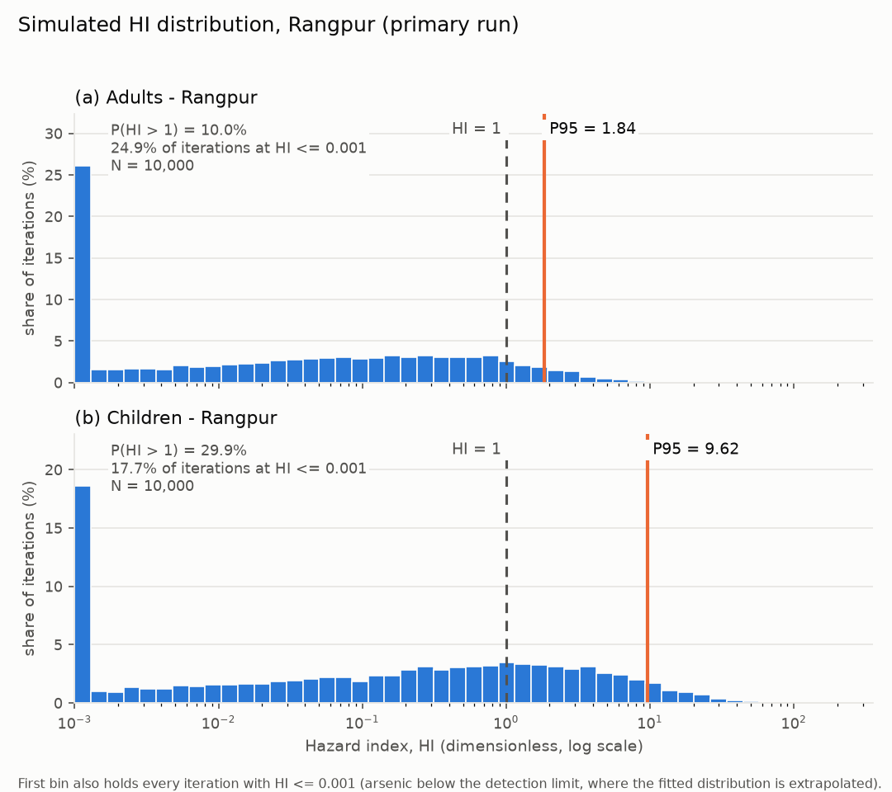
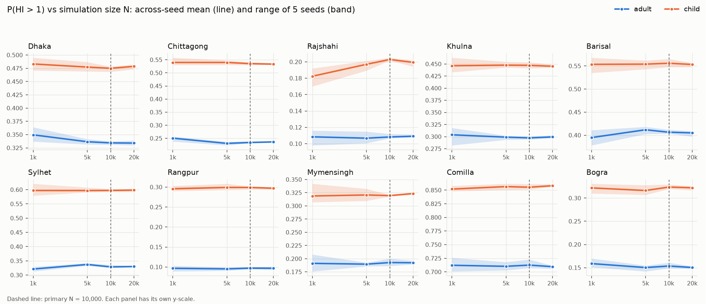
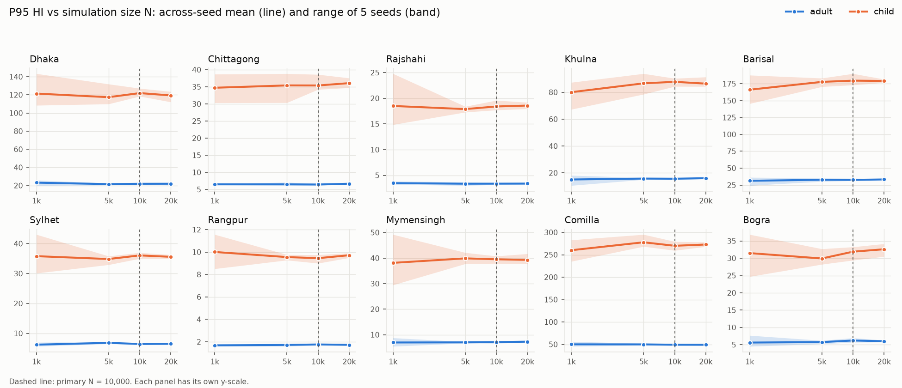
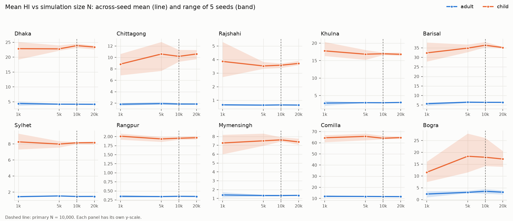
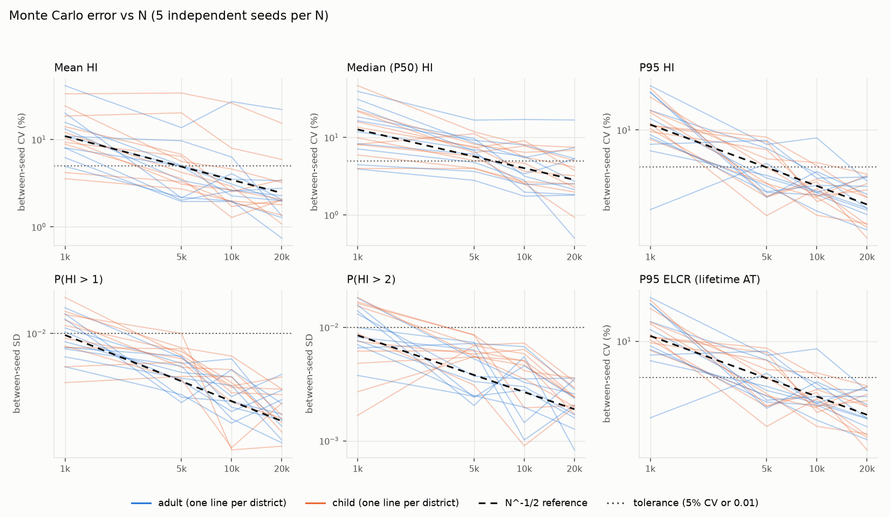
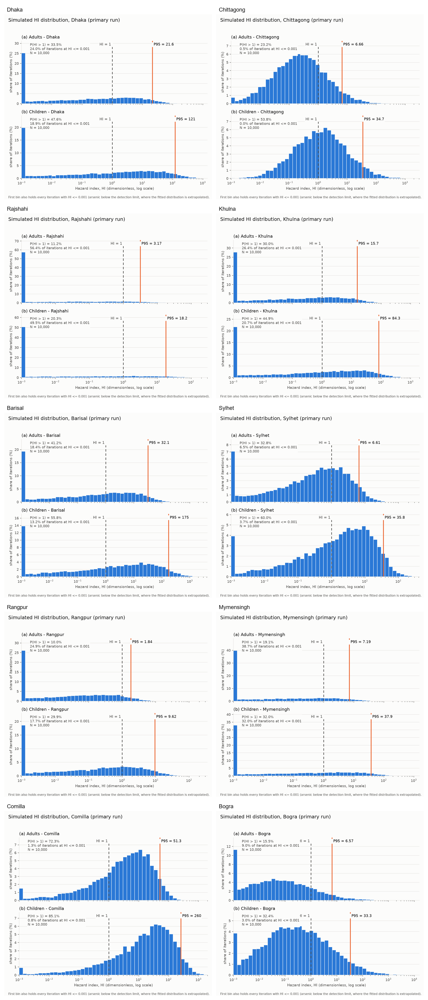

# Probabilistic Health-Risk Simulation and Convergence Analysis

## Main findings

The probabilistic analysis answers two questions: how arsenic-related health risk varies across plausible exposure conditions, and whether the Monte Carlo estimates are numerically stable.

| Finding | Result |
|---|---|
| Highest modeled non-cancer risk | Comilla: `P(HI > 1)` = **72.3% for adults** and **85.1% for children** |
| Lowest modeled non-cancer risk | Rangpur for adults (**10.0%**) and Rajshahi for children (**20.3%**) |
| Population difference | Child P95 HI is **5.1–5.7 times** adult P95 HI in every district |
| Upper-tail risk | P95 HI exceeds 1 for both populations in all ten districts |
| Cancer-risk benchmark | `P(ELCR > 10⁻⁴)` ranges from **19.2–85.6% for adults** and **15.0–78.1% for children** |
| Exposure pathway | Ingestion accounts for almost all HI; dermal exposure contributes only **0.1–0.3% of mean HI** |
| Deterministic limitation | Probabilistic P95 HI is **1.8–5.4 times** the deterministic HI, while P50 HI is lower than the deterministic value in every district |
| Primary simulation precision | At `N = 10,000`, `P(HI > 1)` satisfies the convergence criterion in **20 of 20** district-population cells |
| Upper-tail precision | P95 HI is adequate at `N = 10,000` in **16 of 20** cells; the remaining four stabilize at `N = 20,000` |

`HI > 1` means that the modeled combined dose exceeds the non-cancer reference-dose benchmark. It is a screening result, not a prediction that disease will occur. ELCR is likewise a modeled excess lifetime risk under the stated exposure assumptions, not observed disease incidence.

---

## 1. Monte Carlo risk model

A deterministic assessment uses one value for concentration, body weight, water intake, and the other exposure variables. The Monte Carlo model instead draws many plausible combinations of these variables. It produces a distribution of possible risk values rather than a single point estimate.

### 1.1 Quantities calculated in every iteration

The average daily doses through ingestion and dermal contact are

\[
ADD_{ing}=\frac{C\,IR\,EF\,ED}{BW\,AT}
\]

\[
ADD_{dermal}=\frac{C\,K_p\,EF\,ED\,ET\,SA\,CF}{BW\,AT}.
\]

The non-cancer pathway-specific hazard quotients and combined Hazard Index are

\[
HQ_{ing}=\frac{ADD_{ing}}{RfD_{ing}},\qquad
HQ_{dermal}=\frac{ADD_{dermal}}{RfD_{dermal}},
\]

\[
HI=HQ_{ing}+HQ_{dermal}.
\]

The excess lifetime cancer risk is

\[
ELCR=ADD_{ing,cancer}\times CSF.
\]

| Output | Interpretation |
|---|---|
| Deterministic value | One result obtained from fixed point inputs |
| P50 | Median of the simulations; half of the simulated values are lower and half are higher |
| P95 | Upper-tail value; 95% of simulated values are lower and 5% are higher |
| `P(HI > 1)` | Fraction of simulations above the non-cancer screening threshold |
| `P(ELCR > 10⁻⁴)` | Fraction of simulations above the selected cancer-risk benchmark |

### 1.2 Uncertain inputs

Six variables are sampled independently in each iteration.

| Input | Symbol | Probability model |
|---|---:|---|
| District arsenic concentration | `C` | District-specific Gamma or Lognormal fit to BGS well data |
| Water ingestion rate | `IR` | Lognormal |
| Body weight | `BW` | Adult Lognormal; child Normal truncated at 1.6 kg |
| Exposure frequency | `EF` | Triangular: 180, 345, 365 days/year |
| Dermal exposure time | `ET` | Triangular: 0.13, 0.20, 0.33 hours/day |
| Exposed skin area | `SA` | Adult Lognormal; child Triangular |

The final concentration model is Gamma for Dhaka, Rajshahi, Khulna, Barisal, Sylhet, Rangpur, Mymensingh, and Comilla, and Lognormal for Chittagong and Bogra.

Two final model choices are important for the upper tail:

- Barisal uses Gamma instead of its provisional Lognormal model. The Lognormal fitted P95 was 3.9 times the empirical P95, its fitted P99 was 19.6 mg/L, and its fitted mean was 29 times the censoring-aware mean. Those values indicated unsupported tail extrapolation.
- Child body weight uses a Normal distribution truncated at the lightest observed weight, 1.6 kg. Its weighted CDF error was about eleven times smaller than the provisional Gamma model, and its estimate of `E[1/BW]` differed from the empirical value by only 0.1%. This matters because dose is inversely proportional to body weight.

### 1.3 Simulation design and checks

| Design element | Value |
|---|---:|
| Districts | 10 |
| Populations | Adult and child |
| Primary simulations | 20 district-population cells |
| Iterations per primary cell | 10,000 |
| Total primary iterations | 200,000 |
| Master seed | 20260923 |
| Sampling method | Explicit inverse-CDF transformation, `X = F⁻¹(U)` |
| Arithmetic precision | 64-bit floating point |

Each district, population, sample size, and replicate has a distinct reproducible random-number stream. Repeating the same run reproduces the same values exactly. Across the primary simulations, all **120 input-sampling checks**—six inputs for each of twenty cells—passed the Kolmogorov–Smirnov validation criterion at `α = 0.1%`. No missing, infinite, or physically invalid value entered the risk equations.

---

## 2. Non-cancer risk

### 2.1 District results

| District | Deterministic HI, adult | P50 HI, adult | P95 HI, adult | `P(HI>1)`, adult | Deterministic HI, child | P50 HI, child | P95 HI, child | `P(HI>1)`, child |
|---|---:|---:|---:|---:|---:|---:|---:|---:|
| Dhaka | 4.89 | 0.142 | 21.57 | 33.5% | 22.56 | 0.716 | 121.1 | 47.7% |
| Chittagong | 3.77 | 0.230 | 6.66 | 23.2% | 17.38 | 1.207 | 34.7 | 53.8% |
| Rajshahi ⚠ | 0.870 | 0.000165 | 3.17 | 11.2% | 4.01 | 0.00113 | 18.2 | 20.3% |
| Khulna | 4.19 | 0.0907 | 15.68 | 30.0% | 19.31 | 0.522 | 84.3 | 44.9% |
| Barisal | 11.07 | 0.380 | 32.06 | 41.2% | 51.07 | 1.905 | 175.1 | 55.8% |
| Sylhet | 2.66 | 0.372 | 6.61 | 32.8% | 12.29 | 2.040 | 35.8 | 60.0% |
| Rangpur | 0.968 | 0.0312 | 1.84 | 10.0% | 4.47 | 0.178 | 9.62 | 29.9% |
| Mymensingh | 1.90 | 0.0114 | 7.19 | 19.1% | 8.74 | 0.0574 | 37.9 | 32.0% |
| Comilla | 16.98 | 4.079 | 51.34 | 72.3% | 78.33 | 20.550 | 259.6 | 85.1% |
| Bogra | 2.11 | 0.0489 | 6.57 | 15.5% | 9.72 | 0.248 | 33.3 | 32.4% |

⚠ Rajshahi has 71.8% non-detect measurements, so its fitted lower distribution and P50 require particular caution. Its P95 and threshold exceedance use concentrations within the measured range and are less affected by this limitation.

Three patterns are clear:

1. **Every district has a meaningful upper-tail non-cancer risk.** Even the lowest adult P95, Rangpur at 1.84, is above the HI threshold of 1.
2. **Comilla is the highest-risk district by a large margin.** Most simulated cases exceed HI = 1 for both populations, and its P95 reaches 51.34 for adults and 259.6 for children.
3. **Children consistently have higher non-cancer risk.** Their smaller body weight produces a larger dose per kilogram, increasing both P95 HI and the probability of exceeding 1.

### 2.2 Distribution shapes

In each figure, blue bars are the percentage of simulations in each HI interval, the dashed black line is `HI = 1`, and the orange line is P95 HI. The horizontal axis is logarithmic because simulated HI spans many orders of magnitude.

#### Comilla: high-risk case

Comilla's distributions are shifted farthest to the right. The adult median is already 4.08 and the child median is 20.55, so more than half of both populations' simulated exposure cases exceed the screening threshold. The wide separation between the median and P95 also shows substantial right-tail variability.

#### Dhaka: mixed distribution around the threshold

Dhaka illustrates why a single deterministic result is incomplete. Its deterministic adult HI is 4.89, but the probabilistic adult median is only 0.142, while the adult P95 is 21.57. The same model therefore contains many low-exposure cases and a smaller but important high-exposure tail.

#### Rangpur: lower-risk case with a remaining upper tail

Rangpur has the lowest adult exceedance probability, but its adult P95 is still above 1. For children, 29.9% of simulations exceed 1 and P95 is 9.62. A district with comparatively lower risk is therefore not equivalent to a risk-free district.

### 2.3 Exposure pathway contribution

| Pathway | Contribution to non-cancer risk |
|---|---|
| Ingestion | Approximately 99.7–99.9% of mean HI |
| Dermal contact | Approximately 0.1–0.3% of mean HI |

Arsenic ingestion through drinking water overwhelmingly determines the combined HI. The dermal pathway remains in the equations for completeness, but it does not change the district ranking or the main non-cancer conclusions.

---

## 3. Cancer risk

The primary ELCR calculation averages exposure over a 70-year lifetime. The threshold comparison uses `10⁻⁴`, equivalent to one modeled excess case per 10,000 similarly exposed people under the model assumptions.

| District | Deterministic ELCR, adult | P50 ELCR, adult | P95 ELCR, adult | `P(ELCR>10⁻⁴)`, adult | Deterministic ELCR, child | P50 ELCR, child | P95 ELCR, child | `P(ELCR>10⁻⁴)`, child |
|---|---:|---:|---:|---:|---:|---:|---:|---:|
| Dhaka | 2.19×10⁻³ | 6.35×10⁻⁵ | 9.68×10⁻³ | 46.0% | 8.68×10⁻⁴ | 2.76×10⁻⁵ | 4.67×10⁻³ | 39.9% |
| Chittagong | 1.69×10⁻³ | 1.03×10⁻⁴ | 2.99×10⁻³ | 50.6% | 6.69×10⁻⁴ | 4.65×10⁻⁵ | 1.34×10⁻³ | 35.3% |
| Rajshahi ⚠ | 3.89×10⁻⁴ | 7.40×10⁻⁸ | 1.42×10⁻³ | 19.2% | 1.54×10⁻⁴ | 4.35×10⁻⁸ | 6.99×10⁻⁴ | 15.0% |
| Khulna | 1.87×10⁻³ | 4.06×10⁻⁵ | 7.03×10⁻³ | 43.4% | 7.43×10⁻⁴ | 2.01×10⁻⁵ | 3.25×10⁻³ | 36.7% |
| Barisal | 4.96×10⁻³ | 1.70×10⁻⁴ | 1.44×10⁻² | 54.7% | 1.97×10⁻³ | 7.34×10⁻⁵ | 6.75×10⁻³ | 47.4% |
| Sylhet | 1.19×10⁻³ | 1.67×10⁻⁴ | 2.96×10⁻³ | 57.5% | 4.73×10⁻⁴ | 7.86×10⁻⁵ | 1.38×10⁻³ | 46.1% |
| Rangpur | 4.33×10⁻⁴ | 1.40×10⁻⁵ | 8.27×10⁻⁴ | 27.6% | 1.72×10⁻⁴ | 6.84×10⁻⁶ | 3.71×10⁻⁴ | 18.0% |
| Mymensingh | 8.48×10⁻⁴ | 5.11×10⁻⁶ | 3.23×10⁻³ | 30.5% | 3.37×10⁻⁴ | 2.21×10⁻⁶ | 1.46×10⁻³ | 25.0% |
| Comilla | 7.60×10⁻³ | 1.83×10⁻³ | 2.30×10⁻² | 85.6% | 3.02×10⁻³ | 7.92×10⁻⁴ | 1.00×10⁻² | 78.1% |
| Bogra | 9.43×10⁻⁴ | 2.19×10⁻⁵ | 2.95×10⁻³ | 30.5% | 3.74×10⁻⁴ | 9.55×10⁻⁶ | 1.28×10⁻³ | 21.9% |

Comilla again has the largest cancer-risk estimates, followed by Barisal. Rajshahi and Rangpur have the lowest exceedance probabilities, but their P95 ELCR values still exceed `10⁻⁴`.

The primary child ELCR values are lower than the adult values even though child HI is higher. This is not a contradiction:

- HI is based on average daily dose during the exposure period, so the smaller child body weight strongly increases HI.
- Primary ELCR averages six years of child exposure over a 70-year lifetime, whereas adult exposure lasts 30 years.
- When the paper's exposure-duration averaging convention is used instead, child P95 ELCR becomes approximately 5.1–5.7 times the adult value.

---

## 4. Adult–child comparison and averaging-time effect

| District | P95 HI, adult | P95 HI, child | Child/adult P95 HI | Child/adult primary P95 ELCR | Child/adult P95 ELCR using paper convention |
|---|---:|---:|---:|---:|---:|
| Dhaka | 21.57 | 121.1 | 5.62× | 0.48× | 5.62× |
| Chittagong | 6.66 | 34.7 | 5.21× | 0.45× | 5.21× |
| Rajshahi ⚠ | 3.17 | 18.2 | 5.73× | 0.49× | 5.74× |
| Khulna | 15.68 | 84.3 | 5.38× | 0.46× | 5.39× |
| Barisal | 32.06 | 175.1 | 5.46× | 0.47× | 5.47× |
| Sylhet | 6.61 | 35.8 | 5.42× | 0.47× | 5.43× |
| Rangpur | 1.84 | 9.62 | 5.22× | 0.45× | 5.23× |
| Mymensingh | 7.19 | 37.9 | 5.27× | 0.45× | 5.28× |
| Comilla | 51.34 | 259.6 | 5.06× | 0.43× | 5.07× |
| Bogra | 6.57 | 33.3 | 5.06× | 0.43× | 5.07× |

The non-cancer population difference is highly consistent across districts. The cancer comparison changes direction only because the primary calculation uses lifetime averaging and the exposure durations differ.

---

## 5. What probabilistic modelling adds

| District example | Population | P50 HI | Deterministic HI | P95 HI | Interpretation |
|---|---|---:|---:|---:|---|
| Comilla | Adult | 4.079 | 16.98 | 51.34 | High risk even at the median, with a much larger upper tail |
| Dhaka | Adult | 0.142 | 4.89 | 21.57 | Deterministic value misses both the low median and the high upper tail |
| Rangpur | Adult | 0.031 | 0.968 | 1.84 | Point estimate is near 1, but 10.0% exceed 1 and P95 is above 1 |
| Rajshahi ⚠ | Adult | 0.000165 | 0.870 | 3.17 | Strong skew and censoring make one central value especially incomplete |

The deterministic calculation is not uniformly conservative or non-conservative. In all districts it is higher than the probabilistic median, but it is lower than the probabilistic P95. It therefore overstates the typical simulated case while understating plausible upper-tail exposure.

Across all district-population cells, probabilistic P95 HI is **1.8–5.4 times** the deterministic HI. This difference is the main added value of the probabilistic model: it separates typical exposure, upper-tail exposure, and the frequency of threshold exceedance instead of compressing them into one number.

---

## 6. Convergence and Monte Carlo error

Monte Carlo results contain numerical sampling error because a finite number of random draws is used. The convergence analysis tests whether this error is small enough for the reported conclusions.

### 6.1 Convergence experiment

| Component | Design |
|---|---:|
| District-population cells | 20 |
| Iteration sizes | 1,000; 5,000; 10,000; 20,000 |
| Independent seeds at each size | 5 |
| Complete simulation runs | 400 |
| Total iterations | 3.6 million |
| Statistics assessed | Mean HI, P50 HI, P95 HI, `P(HI>1)`, `P(HI>2)`, P95 ELCR |

For a statistic `T`, the five independent seeds produce an across-seed mean `T̄_N`, a between-seed standard deviation `s_N`, and the successive change

\[
\Delta_T(N)=\frac{|\bar T_N-\bar T_{N_{previous}}|}{|\bar T_N|}\times100\%.
\]

The adequacy criteria are:

| Statistic type | Successive-size condition | Between-seed condition |
|---|---:|---:|
| Continuous: mean, P50, P95 HI, P95 ELCR | Relative change ≤ 5% | CV ≤ 5% |
| Probabilities: `P(HI>1)`, `P(HI>2)` | Absolute change ≤ 0.01 | SD ≤ 0.01 |

The smallest adequate size must satisfy both conditions at that size and at every larger tested size. No tested size is treated as the exact truth.

### 6.2 Stability of the headline probability

Each line is the across-seed mean and each band is the range across five seeds. The vertical reference marks the primary size of 10,000 iterations. `P(HI > 1)` is adequate at `N = 10,000` for all 20 district-population cells. Its worst between-seed standard deviation at that size is 0.67 percentage points, for Barisal children.

For a directly counted probability `p`, the theoretical Monte Carlo standard error is

\[
MCSE=\sqrt{\frac{p(1-p)}{N}}.
\]

At `N = 10,000`, the MCSE for every primary `P(HI > 1)` estimate is at most 0.005, or 0.5 percentage points. The observed between-seed SD averages 0.83 times the theoretical binomial MCSE, which is consistent with the expected sampling behavior given only five seeds.

### 6.3 Stability by statistic

| Statistic | Adequate at `N = 10,000` | Stabilizes within tested grid | Main interpretation |
|---|---:|---:|---|
| `P(HI > 1)` | **20 / 20** | 20 / 20 | All headline exceedance probabilities are numerically stable |
| `P(HI > 2)` | 19 / 20 | 20 / 20 | One cell narrowly misses the 1-point criterion at 10,000 |
| P95 HI | **16 / 20** | 20 / 20 | Four upper-tail cells require the 20,000 check |
| P95 ELCR | 16 / 20 | 20 / 20 | Same upper-tail stability pattern as HI |
| Mean HI | 16 / 20 | 17 / 20 | Heavy-tailed Bogra means remain unstable |
| P50 HI | 10 / 20 | 12 / 20 | Several medians lie in the poorly resolved below-detection region |

### 6.4 Upper-tail convergence

Four cells require `N = 20,000` under the formal all-larger-size criterion.

| Cell | P95 HI at 10,000, primary seed | P95 HI at 20,000, same replicate | Absolute relative difference |
|---|---:|---:|---:|
| Bogra adult | 6.570 | 6.294 | 4.4% |
| Bogra child | 33.266 | 30.505 | 9.1% |
| Chittagong child | 34.713 | 35.922 | 3.4% |
| Sylhet adult | 6.605 | 6.563 | 0.6% |

The largest primary-to-check difference is 9.1% for Bogra children. This changes the numerical P95 estimate but not the risk classification: both values remain far above HI = 1. The 10,000-iteration values remain the common primary results, while the 20,000-iteration values quantify the extra uncertainty for these four cells.

### 6.5 Why the Bogra mean does not converge quickly

Bogra's selected concentration model is Lognormal with `σ_log = 2.86`. This produces a very heavy right tail. The coefficient of variation of a single concentration draw is approximately

\[
\sqrt{e^{\sigma^2}-1}\approx60.
\]

Under simple Monte Carlo scaling, reaching a 5% CV for the mean would require roughly

\[
N\approx\left(\frac{60}{0.05}\right)^2\approx1.4\text{ million iterations}.
\]

The unstable mean is therefore a mathematical consequence of the fitted heavy tail, not evidence of a software failure. Bogra's P95 and exceedance probability are more stable and more defensible than its mean because they are less dominated by extremely rare draws.

### 6.6 Error decay with sample size

The between-seed error decreases approximately as `N⁻¹ᐟ²`, the expected Monte Carlo rate. Increasing the simulation from 10,000 to 20,000 iterations therefore reduces random error by only about

\[
\sqrt{\frac{10{,}000}{20{,}000}}=\frac{1}{\sqrt 2}\approx0.71,
\]

or 29%, rather than cutting it in half. For P95 HI, the median between-seed CV falls from 11.1% at 1,000 iterations to 3.3% at 10,000 and 2.8% at 20,000.

---

## 7. Interpretation of the combined evidence

### Risk ranking

Comilla is consistently the most concerning district under every major measure: deterministic HI, probabilistic P50 and P95, `P(HI > 1)`, P95 ELCR, and `P(ELCR > 10⁻⁴)`. Barisal, Dhaka, and Khulna also have large upper-tail non-cancer risks. Rangpur and Rajshahi are lower relative to the other districts, but neither is free of modeled risk.

### Population vulnerability

Children have much greater non-cancer risk because a similar intake is divided by a much smaller body weight. Their P95 HI is approximately five times the adult value in every district. The apparently lower primary child ELCR is caused by lifetime averaging of a six-year childhood exposure period and does not imply lower dose intensity during childhood.

### Why the probability is the strongest headline result

`P(HI > 1)` directly describes how frequently the model crosses the non-cancer screening threshold. It is stable at 10,000 iterations in every district-population cell, its maximum primary-run MCSE is only 0.5 percentage points, and it is less sensitive than the mean to rare, extreme concentration draws.

### Numerical uncertainty versus model uncertainty

The convergence study quantifies **Monte Carlo error**: variation caused by finite random sampling from a fixed model. Increasing `N` reduces this error. It does not remove uncertainty in the fitted concentration distributions, exposure assumptions, or source data. Those are model and parameter uncertainties and can remain large even when the simulation itself is numerically converged.

---

## 8. Limitations

| Limitation | Effect on interpretation |
|---|---|
| Inputs are sampled independently | Correlations among concentration, intake, body weight, and behavior are not represented because no joint dataset was available |
| BGS wells are not a population-weighted census | Results characterize the modeled sampled-well distributions, not the exact risk prevalence of every district resident |
| Arsenic below detection limits is distributional extrapolation | P50 and lower percentiles are less reliable, especially in highly censored Rajshahi; P95 and threshold results are less affected |
| Bogra has a heavy Lognormal concentration tail | The mean is highly unstable and tail-related results carry additional model uncertainty |
| Rangpur's fitted Gamma has a thin extreme tail | Very extreme risks may be underestimated beyond approximately the P99 region |
| Child body-weight data cover ages 0–59 months | The assumed six-year childhood exposure includes a 60–71 month interval not directly represented by the weight data |
| HI and ELCR are screening-model outputs | They are not diagnoses, observed case counts, or direct predictions of individual illness |

---

## Conclusion

The Monte Carlo model reveals information that a deterministic calculation cannot provide. Risk is strongly right-skewed: the deterministic estimate is above the simulated median but below the simulated P95 in every district. All ten districts have P95 HI above 1 for adults and children, and Comilla has the clearest and most persistent high-risk pattern. Children have substantially higher non-cancer risk, while the direction of the child–adult cancer comparison depends on the averaging-time convention.

The convergence analysis supports the numerical reliability of the central conclusion. At 10,000 iterations, `P(HI > 1)` is stable in all 20 district-population cells, and P95 HI is stable in 16 of 20. The four remaining P95 cells are resolved by the 20,000-iteration check without changing any risk classification. Bogra's mean remains unstable because of its fitted heavy tail, so the threshold probability and P95 are more defensible summaries than the mean for that district.

---

## Appendix: All-district non-cancer risk distributions

**Figure A1. Adult and child Hazard Index distributions for all ten districts at `N = 10,000`.** Each district contains an adult and a child subfigure. Blue bars show the percentage of Monte Carlo iterations in each HI interval, the dashed black line marks the non-cancer screening threshold `HI = 1`, and the orange line marks P95 HI. The horizontal axis is logarithmic. Values at or below `HI = 0.001` are combined in the first interval because the fitted distributions extend into the unresolved below-detection region.

| District | Main finding visible in the subfigures |
|---|---|
| Dhaka | Broad right tail; 33.5% of adult and 47.7% of child simulations exceed HI = 1 |
| Chittagong | Child distribution crosses the threshold much more frequently than the adult distribution: 53.8% versus 23.2% |
| Rajshahi ⚠ | Large near-zero fraction caused by high censoring, but P95 remains above 1 for both populations |
| Khulna | Substantial upper tail, with child P95 HI reaching 84.3 |
| Barisal | One of the highest-risk districts; child P95 HI reaches 175.1 |
| Sylhet | Adult risk is mixed around the threshold, while 60.0% of child simulations exceed 1 |
| Rangpur | Lowest adult exceedance probability at 10.0%, although adult P95 still reaches 1.84 |
| Mymensingh | Low medians coexist with long right tails and P95 HI values of 7.19 and 37.9 |
| Comilla | Strongest rightward shift and highest risk: 72.3% of adults and 85.1% of children exceed 1 |
| Bogra | Heavy Lognormal tail produces wide distributions; P95 is more reliable than the unstable mean |
